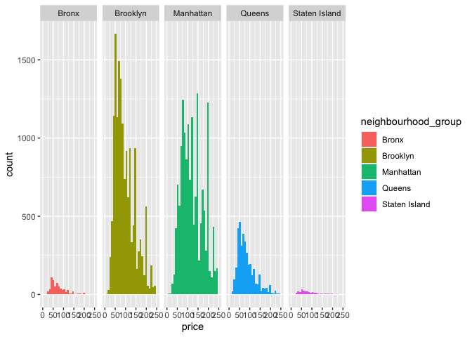
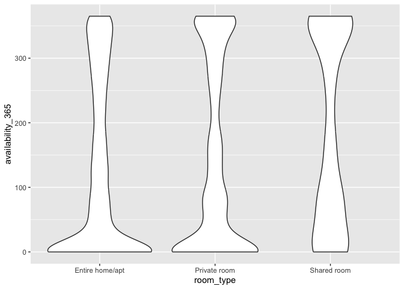
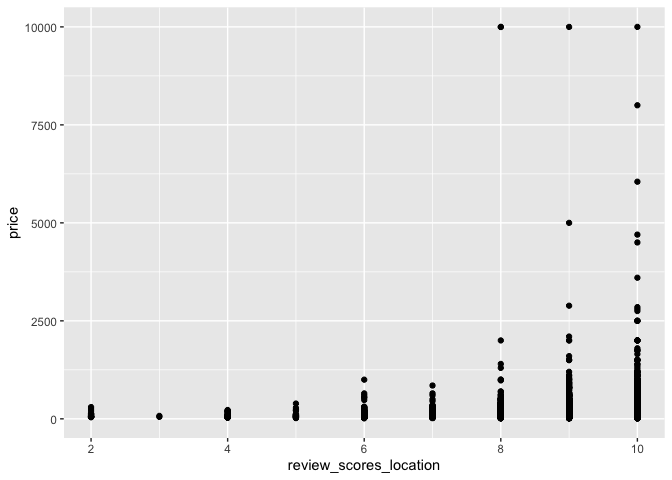
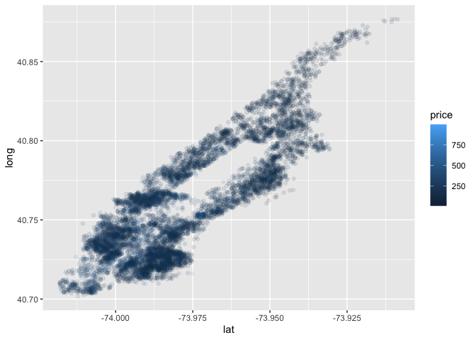

Case Study
================

Load key packages

``` r
library(tidyverse)
```

    ## ── Attaching core tidyverse packages ──────────────────────── tidyverse 2.0.0 ──
    ## ✔ dplyr     1.1.4     ✔ readr     2.1.5
    ## ✔ forcats   1.0.0     ✔ stringr   1.5.1
    ## ✔ ggplot2   3.5.1     ✔ tibble    3.2.1
    ## ✔ lubridate 1.9.3     ✔ tidyr     1.3.1
    ## ✔ purrr     1.0.2     
    ## ── Conflicts ────────────────────────────────────────── tidyverse_conflicts() ──
    ## ✖ dplyr::filter() masks stats::filter()
    ## ✖ dplyr::lag()    masks stats::lag()
    ## ℹ Use the conflicted package (<http://conflicted.r-lib.org/>) to force all conflicts to become errors

``` r
library (p8105.datasets)
data(nyc_airbnb)
```

## Brainstorm Questions

- Where are the max and min airbnb prices?
  - What are average prices?
  - Where are prices going up and down?
- What’s the relationship between number of reviews and average review?
- Does room type affect availability?
- What’s the location of the unit?
- What areas are popular?
  - Popularity = number of units? average price?
- Are there repeat hosts?
  - If so, what does that mean?

Lets start coding - max and min

``` r
max(pull(nyc_airbnb, price))
```

    ## [1] 10000

``` r
min(pull(nyc_airbnb, price))
```

    ## [1] 10

Color-coded histogram showing the distribution of prices by borough

``` r
nyc_airbnb %>%
  ggplot(aes(x = price, fill = neighbourhood_group)) +
  geom_histogram() +
  facet_grid(. ~ neighbourhood_group) +
  scale_x_continuous(limits = c(0, 250))
```

    ## `stat_bin()` using `bins = 30`. Pick better value with `binwidth`.

    ## Warning: Removed 3810 rows containing non-finite outside the scale range
    ## (`stat_bin()`).

    ## Warning: Removed 10 rows containing missing values or values outside the scale range
    ## (`geom_bar()`).

<!-- -->

Room type availability

``` r
plot = ggplot(data = nyc_airbnb, aes(x = room_type, y = availability_365)) +
  geom_violin()
print(plot)
```

<!-- -->

Total reviews by borough

``` r
number_of_reviews <- nyc_airbnb %>%
  group_by(neighbourhood_group) %>%
  summarise(total_reviews = sum(number_of_reviews, na.rm = TRUE)) %>%
  arrange(desc(total_reviews))
print(number_of_reviews)
```

    ## # A tibble: 5 × 2
    ##   neighbourhood_group total_reviews
    ##   <chr>                       <dbl>
    ## 1 Manhattan                  323941
    ## 2 Brooklyn                   263542
    ## 3 Queens                      66611
    ## 4 Bronx                        9897
    ## 5 Staten Island                4744

``` r
nyc_airbnb |>
  ggplot(aes(x=review_scores_location, y=price)) +
  geom_point()
```

    ## Warning: Removed 10037 rows containing missing values or values outside the scale range
    ## (`geom_point()`).

<!-- -->

``` r
nyc_airbnb |>
  filter(
    neighbourhood_group == "Manhattan",
    price < 1000,
    room_type == "Entire home/apt") |>
  group_by(neighbourhood) |>
  ggplot(aes(x=lat, y=long, color=price))+
  geom_point(alpha=0.1)
```

<!-- -->
